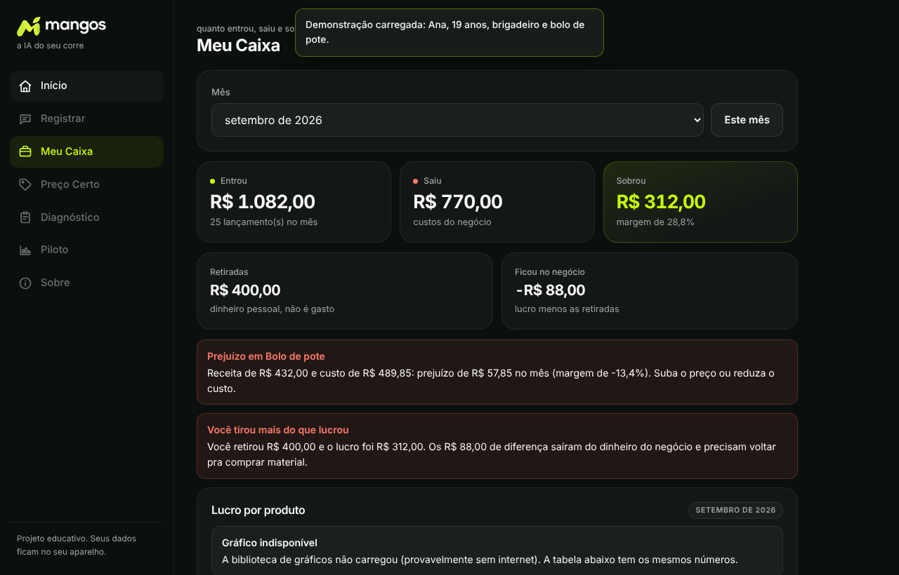

# Mangos

Aplicação web de gestão de caixa para microempreendedores jovens, com registro de movimentações em linguagem natural.


**Demonstração:** [sergiomeyer23.github.io/Mangos](https://sergiomeyer23.github.io/Mangos/)



## Sumário

- [Visão geral](#visão-geral)
- [Funcionalidades](#funcionalidades)
- [Arquitetura](#arquitetura)
- [Privacidade e tratamento de dados](#privacidade-e-tratamento-de-dados)
- [Instalação e execução](#instalação-e-execução)
- [Testes](#testes)
- [Estrutura do código](#estrutura-do-código)
- [Limitações conhecidas](#limitações-conhecidas)
- [Autor](#autor)
- [Licença](#licença)

## Visão geral

Jovens que vendem por conta própria (alimentos, revenda, serviços) frequentemente não separam as finanças do negócio das pessoais e não conseguem determinar se houve lucro. Ferramentas de contabilidade pressupõem uma empresa formalizada; planilhas exigem familiaridade que o público não tem.

O Mangos aceita entradas como:

```
vendi 6 bolos de pote a 12 e gastei 40 de ingrediente
```

e as converte em lançamentos estruturados, consolidando receitas, despesas, resultado por produto e sugestão de preço.

O projeto foi desenvolvido para o NAUFest Challenge 2026 (#AIForImpact, Junior Achievement Americas e HP).

## Funcionalidades

| Módulo | Descrição |
|---|---|
| Registrar | Conversão de texto livre em lançamentos de entrada e saída |
| Meu Caixa | Totais de entradas, saídas e saldo do período |
| Preço Certo | Cálculo do preço de venda a partir do custo e da margem desejada |
| Diagnóstico | Análise em linguagem simples do estado do caixa, com alertas (ex.: retiradas superiores ao lucro) |
| Piloto | Questionário antes/depois e exportação dos resultados para Excel |
| Sobre | Privacidade, configuração da chave de API, backup e execução dos autotestes |

O modo demonstração utiliza dados de uma personagem fictícia, identificada como tal na interface.

## Arquitetura

Aplicação de página única, sem backend e sem etapa de build.

- **Interface:** HTML, CSS e JavaScript sem frameworks.
- **Persistência:** `localStorage` do navegador.
- **Bibliotecas externas (CDN):** Chart.js (gráficos), SheetJS (exportação para Excel), fonte Sora (Google Fonts).
- **IA:** Google Gemini (`gemini-2.5-flash`), chamado diretamente do navegador.

### Separação entre IA e cálculo

O modelo de linguagem é usado exclusivamente para:

1. extrair dados estruturados (JSON) do texto digitado;
2. redigir explicações em linguagem natural.

Todo cálculo numérico (totais, lucro por produto, preço) é executado por funções determinísticas em JavaScript, cobertas por testes. Isso garante resultados reproduzíveis e elimina o risco de valores gerados pelo modelo.

### Degradação sem IA

Na ausência de chave de API, ou em caso de falha da requisição, a extração é feita por um módulo baseado em expressões regulares e o diagnóstico por uma função local. Nenhuma funcionalidade depende da disponibilidade do serviço externo.

## Privacidade e tratamento de dados

- Os dados são armazenados apenas no navegador do usuário. Não há servidor operado pelo projeto.
- Com a IA **habilitada**, são enviados ao Gemini: o texto digitado em *Registrar* e os totais agregados usados em *Diagnóstico*.
- Com a IA **desabilitada**, nenhum dado sai do dispositivo.
- A chave de API é mantida somente no navegador.
- A tela *Sobre* permite exportar e apagar todos os dados.

## Instalação e execução

Não há dependências a instalar.

```bash
git clone https://github.com/sergiomeyer23/Mangos.git
cd mangos
```

Abra `index.html` no navegador, ou sirva localmente:

```bash
python3 -m http.server 8000
# http://localhost:8000
```

Para habilitar a IA, gere uma chave no [Google AI Studio](https://aistudio.google.com/) e informe-a na tela *Sobre*.

> Chart.js e SheetJS são carregados via CDN. Sem conexão, gráficos e exportação para Excel ficam indisponíveis; as demais funções continuam operando.

## Testes

A suíte contém 28 autotestes, abrangendo cálculos, normalização de lançamentos, extração por regras e diagnóstico local.

Execução:

- abrir `index.html?teste=1`; ou
- no console do navegador: `Mangos.rodarTestes()`

## Estrutura do código

Todo o código está em `index.html`.

| Função | Responsabilidade |
|---|---|
| `calcularTotais` | Consolidação de entradas, saídas e saldo |
| `calcularPorProduto` | Resultado por produto |
| `calcularPreco` | Preço de venda a partir de custo e margem |
| `normalizarLancamento` | Validação e normalização de lançamentos |
| `extrairLancamentosPorRegras` | Extração offline por expressões regulares |
| `gerarDiagnosticoLocal` | Diagnóstico sem uso de IA |
| `paraNumero`, `fmtBRL` | Conversão e formatação de valores monetários |
| `rodarTestes` | Execução dos autotestes |

As chaves de `localStorage` mantêm o prefixo `caixajovem.v1.` por compatibilidade com versões anteriores do projeto (nome anterior: Caixa Jovem).

## Limitações conhecidas

- Projeto em estágio de protótipo, testado com número reduzido de usuários.
- Dados vinculados a um único navegador; a migração entre dispositivos depende de exportação manual.
- O extrator por regras cobre estruturas de frase comuns e pode falhar com textos pouco estruturados.
- Não constitui ferramenta contábil ou fiscal e não oferece recomendação de investimentos.
- Os resultados de impacto não foram validados em escala.

## Autor

**Sérgio Meyer**
LinkedIn: [linkedin.com/in/sérgio-meyer](https://www.linkedin.com/in/s%C3%A9rgio-meyer-7aaa45407/) · E-mail: sergio.gabriel.meyer10@gmail.com

## Licença

Distribuído sob a licença MIT. Consulte o arquivo [LICENSE](LICENSE).